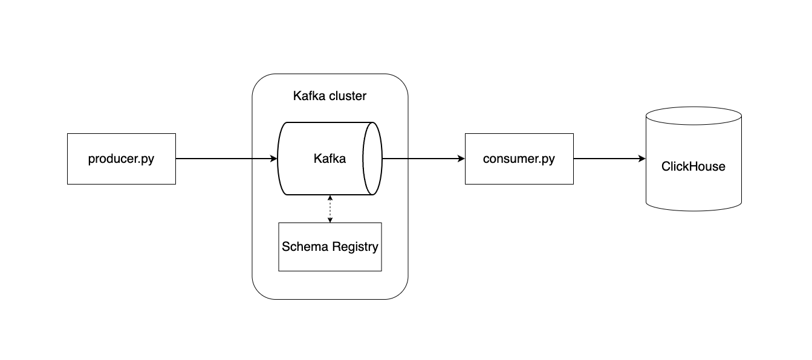

# python-kafka-etl

## Architecture



## Installation

### Kafka 

#### Start Kafka cluster:
```bash
docker-compose up -d --remove-orphans
```


#### Create topic:
```bash
docker exec broker \
kafka-topics --bootstrap-server broker:9092 \
             --create \
             --topic transaction
```

#### Create a new Avro schema:
Create a new Avro schema file in `event/`

Then, to send schema to Schema Registry:
```bash
sh utils/send_schema_to_schema_registry.sh transaction
```

## Clickhouse
Enter Clickhouse:
```bash
docker exec -it clickhouse-server clickhouse-client
```

Create a new table;
```sql
CREATE OR REPLACE TABLE transaction
(
    event_id String,
    timestamp DateTime,
    consumer_id String,
    bank_id String,
    amount Float64,
    country_code String,
    execution_date String,
    merchant_id String
) ENGINE = MergeTree()
ORDER BY event_id
PRIMARY KEY event_id
TTL timestamp + INTERVAL 2 YEAR;
```

### Python
Create a python environment with Pyenv:
```bash
pyenv virtualenv 3.11.0 kafka-python
```

Activate Pyenv:
```bash
pyenv shell kafka-python
```

Install requirements:
```bash
pip install -r requirements.txt
```

Start consuming:
```bash
python src/consumer.py
```

Producing events:
```bash
python src/producer.py --number-of-events 5
```

